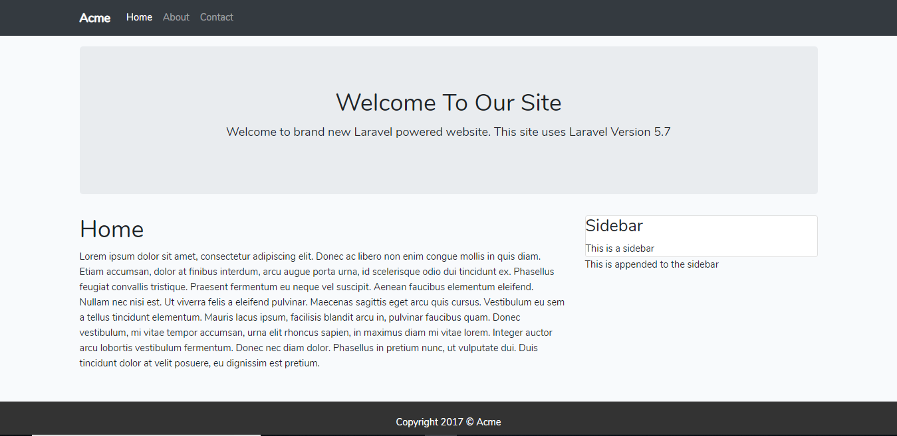

# BasicWebsite-Laravel-project

## Table of Contents

* [Description](#Description)
* [Dependencies](#dependencies)

## Description

This project is Basic Website which I used PHP and Laravel to create.

## Achievements
* Installing Laravel and setting up the database
* Create routes
* MVC Structure
* Compiling frontend assets with Laravel Mix
* Laravel Collective Forms

The following photo is the Home page:

## Dependencies

The project is cooperated with a PHP framework is Laravel, a JavaScript framework is Bootstrap and MySQL Database.
